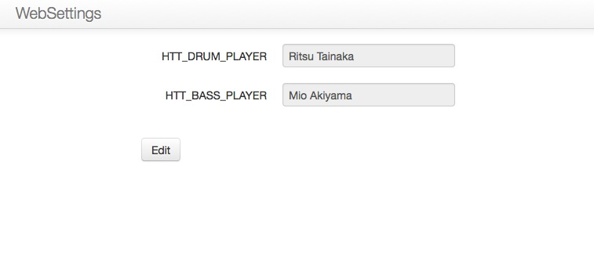
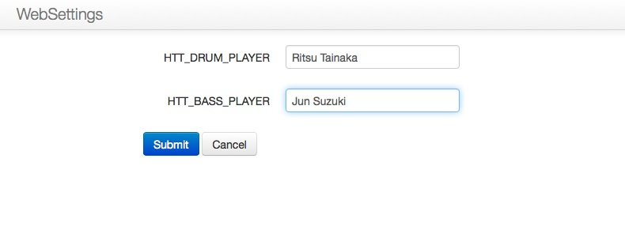

Getting Started
===============

This documentation provide the basically usage of django-websettings.

Installation
------------

Environment
^^^^^^^^^^^^

django-websettings can be run on the 1.4, 1.5 of Django and
2.7, 3.2, 3.3 of CPython, 2.0 of PyPy.

If you want to use Django 1.4, you should choice Python 2.7, because
Django 1.4 does not support Python 3.

Install
^^^^^^^^

To install django-websettings, you should just install
``django-websettings`` on own environment.

.. code-block:: sh

    $ pip install django-websettings

And add line to INSTALLED_APPS to your settings.py:

.. code-block:: python

    INSTALLED_APPS = (
        ...
        'websettings',
        ...
    )

Then sync to your DB:

.. code-block:: sh

    $ python manage.py syncdb

Websettings file
^^^^^^^^^^^^^^^^

You shuoud put ``websettings.py`` file contains the setting keys and
default values.

It recommended to put it under project directory.
Let's put empty websettings.py

.. code-block:: sh

    $ cd /path/to/yourproject/
    $ touch websettings.py

And then, you should tell the position of websettings.py
by specifying a WEBSETTINGS_MODULE value in your project's
settings.py file:

.. code-block:: python

    # In your settings.py file.
    WEBSETTING_MODULE = 'yourproject.websettings'

Web interface URL
^^^^^^^^^^^^^^^^^

The url to web interface to set setting values can be included like this:

.. code-block:: python

    # In your urls.py file.
    url(r'^websettings/', include('websettings.urls'))

The admin user can only access this page.

django-websettings does not privide the login and logout page, so
it is also necessary to provide them.

Tutorial
---------

Now, you can use some great features provided by django-websettings.

Setting websettings
^^^^^^^^^^^^^^^^^^^^

You can write values your websettisgs.py, like this:

.. code-block:: python

    # In your websettings.py
    HTT_DRUM_PLAYER = 'Ritsu Tainaka'
    HTT_BASS_PLAYER = 'Mio Akiyama'

Please be careful in following:

- Values can accept only strings
- All of these keys must explain by UPPER_CASE

And then, you can get these values from websettings.websettings module.
You can try getting it in your Django shell:

.. code-block:: python

    >>> from websettings import websettings
    >>> websettings.HTT_DRUM_PLAYER
    'Ritsu Tainaka'
    >>> websettings.HTT_BASS_PLAYER
    'Mio Akiyama'

Using Web interface
^^^^^^^^^^^^^^^^^^^

Now, you can change these setting values from web interface generated
automatically.

Let's access to the URL ``/websettings/`` after logged in by admin user.
you will see a page, like this:

- It provides a list of settings you wrote in websettings.py.
- Value of setting is handled as default value of each forms.
- The value accept only string up to 255 character.

And then, you can change the values by using it.
If you want to fire Mio and hire Jun as bassist, you can click ``Edit``
button and change the value.

Ok, and submit the form.
Let's try getting ``HTT_BASS_PLAYER`` value again in shell:

.. code-block:: python

    >>> websettings.HTT_BASS_PLAYER
    'Jun Suzuki'

Yay!

Conclusion
----------

That's basic usage and feature of django-websettings.

You set default values, use setting values,
then fix values from web interface if you feel like it.
